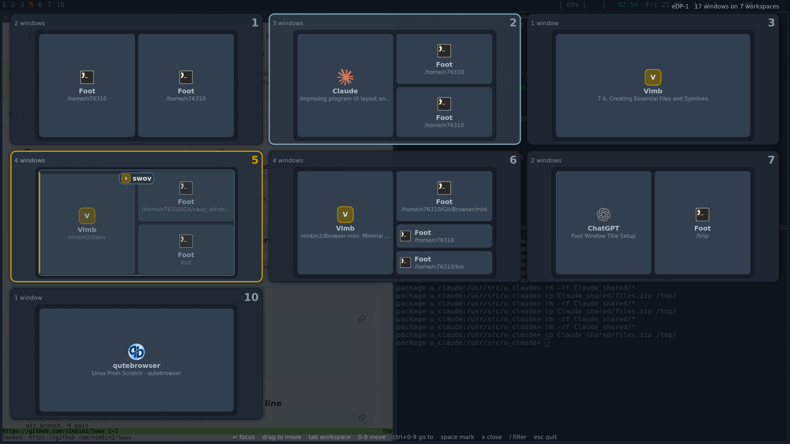

# swov

A fast window and workspace overview for [Sway](https://swaywm.org), drawn with
SDL3.

Every workspace becomes a tile, and inside that tile the windows sit exactly
where they sit on the real screen — same proportions, same positions. Click a
window to focus it, click a tile to switch to that workspace, or drive the whole
thing from the keyboard.



## Features

- Talks to the Sway IPC socket directly. No `swaymsg`, no `jq`, no shelling out.
- Tiles keep the aspect ratio of the monitor, so a tile is a true miniature of
  the workspace.
- Select a whole workspace and press a digit to move **everything** on it to
  another workspace. Top level containers are moved as containers, so splits and
  tabs survive the move intact.
- Drag and drop: move a window to another workspace, drop it on the left, right,
  top or bottom edge of another window to place it there — the container is
  split horizontally or vertically to match — or drag a whole workspace to
  reorder it.
- Cards adapt to the space they get: icon + name + title when there is room,
  icon left / text right on wide flat cards, name only when things get tight.
  Long titles are shortened with a real ellipsis measured against the available
  width — never squashed, never cut mid-character.
- Tabbed and stacked containers, which report one identical rectangle for all
  their children, are split into slices with a shared outline.
- Floating and fullscreen windows are drawn as see-through frames with a name
  plate at the top edge, so the windows underneath stay readable instead of
  disappearing behind a solid card.
- Windows whose `app_id` says nothing useful — GTK apps started without one
  report `GTK Application`, and several Electron builds are no better — are
  identified from the process behind the window and from the window title, so a
  card reads `Claude` rather than `GTK Application`.
- Icons come from `.desktop` files (including `StartupWMClass` matching) and the
  icon theme; SVGs are rasterised at the size they are drawn at. Applications
  without an icon get a generated letter tile.
- Hover feedback on tiles and windows, spatial keyboard selection that crosses
  tile borders, multi-selection, and type-to-filter.
- Everything is configurable — sizes, spacing, fonts, colors, where the text
  lines sit — from a config file or straight from the command line.

## Building

Debian trixie and newer ship SDL3:

```sh
sudo apt install build-essential pkg-config \
     libsdl3-dev libsdl3-image-dev libsdl3-ttf-dev
```

On Debian bookworm the SDL3 packages are not available yet; build
[SDL](https://github.com/libsdl-org/SDL),
[SDL_image](https://github.com/libsdl-org/SDL_image) and
[SDL_ttf](https://github.com/libsdl-org/SDL_ttf) from source (release 3.2 or
newer) and point `PKG_CONFIG_PATH` at your install prefix.

```sh
cc -std=c11 -O2 -Wall -Wextra -o swov swov.c \
   $(pkg-config --cflags --libs sdl3 sdl3-image sdl3-ttf)
install -Dm755 swov ~/.local/bin/swov
```

Runtime requirements: a running Sway session (`$SWAYSOCK`) and any TTF font.
`fc-match` is used once to resolve the desktop font; without fontconfig a few
well known font paths are tried instead.

## Using it

```
bindsym $mod+Tab exec swov
for_window [app_id="swov"] floating enable, border none
```

The overlay covers the focused output, dims what is behind it, and closes itself
when it loses focus.

### Keys

| key | action |
| --- | --- |
| `Enter` / left click | focus the selected window; on a whole workspace, switch to it |
| left click on a tile | switch to that workspace and leave |
| drag a window | move it: onto a tile, or onto an edge of another window |
| drag a workspace | reorder it: swap, insert, or drop on a free number |
| right click on a tile | select that workspace without switching |
| arrows or `h j k l` | move the selection; the first press steps into the workspace, further presses cross into neighbouring tiles |
| `Tab` / `Shift+Tab` | next / previous workspace, at workspace level |
| `w` | toggle between window selection and whole-workspace selection |
| mouse wheel | next / previous workspace |
| `space` / right click | mark a window; at workspace level, mark all of them |
| `a` | mark or unmark every window of the workspace |
| `c` | clear all marks |
| `0`–`9` | move marked or selected windows there; with a workspace selected, move the whole workspace, layout and all |
| `Ctrl+0`–`9` | switch to that workspace and leave |
| `x`, `Delete`, middle click | close marked or selected windows |
| `/` | filter by application, title or workspace name |
| `r` | reload the tree |
| `Esc` | cancel a drag, otherwise quit |
| `q`, click outside | quit |

Nothing is selected inside a workspace when swov opens: the visible workspace is
highlighted as a whole, so a digit key immediately moves that workspace
somewhere else. Press an arrow key or `w` to descend to single windows.
`start_selection=none` starts with no highlight at all, `start_selection=window`
picks the first window.

A click only acts when the press and the release land on the same window or the
same workspace, so nothing is focused by accident at the end of a drag.

Digits are read bare or with `ctrl`; a shifted digit is left alone, because on
plenty of layouts `shift+7` is how you type `/`.

### Drag and drop

Press and move to start a drag; the drop happens on release, and `Esc` cancels.

**Dragging a window**

- onto a workspace tile — moves it there
- onto a free number — creates that workspace and puts the window in it
- onto the left or right edge of another window — lands beside it, the container
  is split horizontally
- onto the top or bottom edge — lands above or below it, split vertically

A bar shows the edge you are about to drop on, so the resulting split is visible
before you let go.

**Dragging a workspace** (grab it by its header strip, not by a window)

- onto the middle of another workspace — the two swap numbers
- onto the left or right quarter of another workspace — inserts there, pushing
  the occupied run up by one: with 1, 2 and 5 in use, dropping before 2 makes
  the old 2 become 3 and stops, because 4 is free
- onto a **ghost slot** — see below

**Ghost slots**

Pick a workspace up and every free number from 0 to 10 joins the grid as a small
placeholder tile; the existing tiles glide aside to make room rather than
snapping (`anim_ms`, 160 ms by default, 0 to switch it off). Drop on a ghost and
the workspace simply takes that number — no shifting, nothing else moves.

Dragging a window does the same as soon as the window leaves the workspace it
lives on, which is how you spin a new workspace out of a single window: drop it
on a free number and sway creates the workspace on the spot. Once they are out they stay out for the rest of the drag, and the test for
"has it left?" uses the rectangle the workspace occupied when the drag started,
not where the tile currently sits. Both matter: the ghosts push the tiles around,
so a threshold that moves with them chases the pointer and the grid shudders —
especially when the drag heads the same way the tiles are sliding.

On the drop the ghosts shrink and fade out rather than blinking away, and the
remaining tiles glide back into place.

Workspaces named like `7:chat` keep their label: dropped on 8 they become
`8:chat`.

## Configuration

swov reads `${XDG_CONFIG_HOME:-~/.config}/swov/config`, a plain `key=value` file
with `#` comments. See `config.example`, which lists every key with its default.

Every one of those keys is also a command line option, in whichever spelling you
prefer:

```sh
swov ui_scale=1.2 hl=ff8800
swov --ssaa=1 --header_pos=top-left
swov -s bg=0d1117ff -s win_gap=8
```

```
usage: swov [options] [key=value ...]
  -c, --config PATH   read this config file instead of the default
  -n, --no-config     ignore the config file
      --shot PATH     render one frame to a PNG and exit (handy for tuning)
  -h, --help          the full key and option list
```

`--shot` renders one frame and exits, so colors and sizes can be tried without
opening the overlay over and over: `swov --shot /tmp/o.png hl=ff8800`.

### Keys worth knowing

- `bg` — the scrim. The default `0d1117cc` dims the desktop behind the overlay so
  the workspace you are actually on stops standing out. `0d111700` gives a fully
  transparent background, `0d1117ff` a solid one. Real background blur is a
  compositor feature and cannot be done from inside the window.
- `header_pos` / `hints_pos` — where the two text lines go: `none`, or
  `top`/`bottom` combined with `left`/`center`/`right`. Defaults are
  `top-right` for the header and `bottom-center` for the key hints; when both
  end up in the same band they dodge each other.
- `win_gap` / `screen_pad` — space between two windows, and the border kept free
  between the mini screen and the windows in it. Raise them for an airier grid.
- `badge_top` — how much air the workspace number gets above it.
- `float_alpha` — how solid floating and fullscreen windows are (0.62 by
  default). The value is scaled down further the more of the workspace the
  window covers, so a fullscreen window all but disappears into its frame while
  a small dialog stays clearly visible. `1.0` makes them solid again.
- `anim_ms` — how long tiles take to glide when the ghost slots appear and
  disappear. `0` makes the change instant.
- `start_selection` — `workspace` (default), `none` or `window`.
- `ssaa` — supersampling, 1 to 4. Fonts are opened at the scaled size, so this
  sharpens text as well as edges. It is reduced automatically on very large
  screens; on a 4K monitor expect it to drop to 1.
- `ui_scale` — one number that scales all four text sizes at once.
- `rows` / `cols` — force the grid. By default swov picks whatever yields the
  largest tiles.

## Speed

Startup is around 100 ms, and most of that is SDL bringing up a window.

- The Sway tree is read over the IPC socket and parsed in process. No `swaymsg`,
  no `jq`, no `/bin/sh` — three process spawns saved before anything is drawn.
- Icon themes are scanned once into a preference ordered directory list, so
  resolving an icon is a handful of `access()` calls instead of the thousands a
  blind size and extension sweep would cost. Results are cached per application,
  so ten terminals load one icon.
- `.desktop` files are indexed lazily, and not at all when `icons=0`.
- fontconfig is consulted once for the regular and the bold cut together, and
  skipped entirely when `font` is given as a path.
- The overview subscribes to sway's window and workspace events on a second
  socket. Sway acknowledges a command before its layout transaction commits, so
  re-reading the tree immediately gives stale geometry — this is what used to
  leave a workspace showing the wrong windows after a move. Now the reload waits
  for sway to say it is done, and the overview also stays correct when something
  changes behind it.
- The event loop repaints only when something actually changed. Mouse motion
  that does not change what is under the cursor does not cost a frame, so an
  idle overlay is essentially free.
- Text is rendered to textures once per layout and tinted per state, so hover and
  selection changes cost nothing extra.

If you want it leaner still: `ssaa=1` halves the fill rate, `shadow=0` removes
several rounded-rect fills per tile, and `icons=0` skips the `.desktop` and icon
theme work completely.

## Notes

- Windows are read from the Sway tree, so what you see is the geometry Sway
  reports, gaps and borders included.
- When sway reports a useless `app_id`, swov reads `/proc/<pid>/cmdline` to find
  the real executable, matches that against the `.desktop` index, and otherwise
  falls back to the tail of the window title.
- Windows in the scratchpad are not shown.
- Moving windows with `0`–`9` keeps the overlay open and refreshes it, so several
  windows can be shuffled in one visit. Set `quit_after_action=1` to have it
  close instead.
- Reordering workspaces works by renaming them, which is the only thing sway
  offers. A swap goes through a temporary name, so nothing collides halfway.
